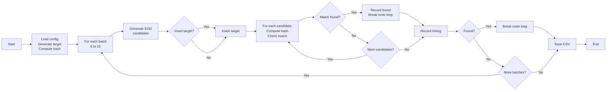
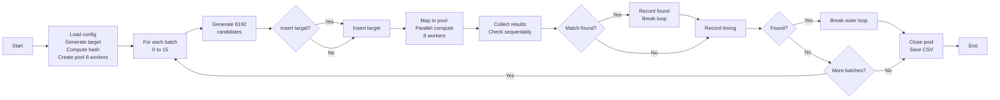
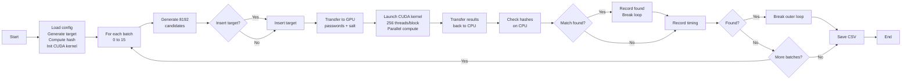

# Sequence Diagrams for PBKDF2 Implementations

## CPU Sequential Implementation

```mermaid
flowchart LR
    A[Start] --> B[Load config<br/>Generate target<br/>Compute hash]
    B --> C[For each batch<br/>0 to 15]
    C --> D[Generate 8192<br/>candidates]
    D --> E{Insert target?}
    E -->|Yes| F[Insert target]
    E -->|No| F
    F --> G[For each candidate:<br/>Compute hash<br/>Check match]
    G --> H{Match found?}
    H -->|Yes| I[Record found<br/>Break inner loop]
    H -->|No| J{More candidates?}
    J -->|Yes| G
    J -->|No| K[Record timing]
    I --> K
    K --> L{Found?}
    L -->|Yes| M[Break outer loop]
    L -->|No| N{More batches?}
    N -->|Yes| C
    N -->|No| O[Save CSV]
    M --> O
    O --> P[End]
```

## CPU Parallel Implementation

```mermaid
flowchart LR
    A[Start] --> B[Load config<br/>Generate target<br/>Compute hash<br/>Create pool 8 workers]
    B --> C[For each batch<br/>0 to 15]
    C --> D[Generate 8192<br/>candidates]
    D --> E{Insert target?}
    E -->|Yes| F[Insert target]
    E -->|No| F
    F --> G[Map to pool:<br/>Parallel compute<br/>8 workers]
    G --> H[Collect results<br/>Check sequentially]
    H --> I{Match found?}
    I -->|Yes| J[Record found<br/>Break loop]
    I -->|No| K[Record timing]
    J --> K
    K --> L{Found?}
    L -->|Yes| M[Break outer loop]
    L -->|No| N{More batches?}
    N -->|Yes| C
    N -->|No| O[Close pool<br/>Save CSV]
    M --> O
    O --> P[End]
```

## GPU Parallel Implementation

```mermaid
flowchart LR
    A[Start] --> B[Load config<br/>Generate target<br/>Compute hash<br/>Init CUDA kernel]
    B --> C[For each batch<br/>0 to 15]
    C --> D[Generate 8192<br/>candidates]
    D --> E{Insert target?}
    E -->|Yes| F[Insert target]
    E -->|No| F
    F --> G[Transfer to GPU<br/>passwords + salt]
    G --> H[Launch CUDA kernel<br/>256 threads/block<br/>Parallel compute]
    H --> I[Transfer results<br/>back to CPU]
    I --> J[Check hashes<br/>on CPU]
    J --> K{Match found?}
    K -->|Yes| L[Record found<br/>Break loop]
    K -->|No| M[Record timing]
    L --> M
    M --> N{Found?}
    N -->|Yes| O[Break outer loop]
    N -->|No| P{More batches?}
    P -->|Yes| C
    P -->|No| Q[Save CSV]
    O --> Q
    Q --> R[End]
```